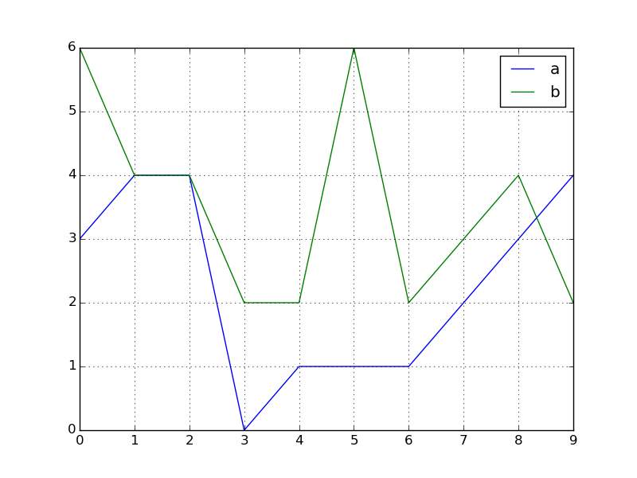

=======================================
 Python Pandas DataFrame Fox's WuShu
=======================================

:Authors:
    Luis Belmar-Letelier <luis.belmar-letelie@mazars.fr>
:Version: 2 (2020/07)

.. raw:: latex

   \etocsettocstyle{}{}\localtableofcontents

Preliminaries
=============

Import
------
.. code:: python

    import pandas as pd
    from pandas import DataFrame, Series
    import numpy as np

To use a 200 cols terminal::

    pd.set_option('display.width', 200)

DataFrame overview
------------------
.. code:: python

                      +---------------------------------+
                      |    Column index (df.columns)    |
                      +---------------------------------+         Series object:
                         |        |        |        |                 An ordered array of data with index. Series
                         V        V        V        V                 arithmetic is vectorized after first aligning
    +------------+    +------+ +------+ +------+ +------+             the Series (row) index of each of the operands.
    |            |    |      | |      | |      | |      |
    | Row index  | -> |      | |      | |      | |      |
    |            |    |Series| |Series| |Series| |Series|         DataFrame object:
    | (df.index) | -> |  of  | |  of  | |  of  | |  of  |             A table of data with column and row indexes.
    |            |    | Data | | Data | | Data | | Data |             The columns are made up of pandas Series object.
    |            | -> |      | |      | |      | |      |             The default df.index is 0..n and
    |            |    |      | |      | |      | |      |             the default df.columns is 0..m.
    +------------+    +------+ +------+ +------+ +------+

Fill DataFrame with data
--------------------------
.. code:: python

  df = pd.DataFrame({'animal': 'cat dog cat fish dog cat cat'.split(),
                     'mysize': list('SSMMMLL'),
                     'weight': [8, 10, 11, 1, 20, 12, 12],
                     'adult': [False] * 5 + [True] * 2});df

Get informations about your DataFrame

.. code:: python

  df
  #    adult animal mysize  weight  age      length
  # 0  False    cat    S       8    3   30.000000
  # 1  False    dog    S      10    4   46.666667
  # 2  False    cat    M      11    5   63.333333
  # 3  False   fish    M       1    6   80.000000
  # 4  False    dog    M      20    7   96.666667
  # 5   True    cat    L      12    8  113.333333
  # 6   True    cat    L      12    9  130.000000

  df.info()

  #     <class 'pandas.core.frame.DataFrame'>
  #   RangeIndex: 7 entries, 0 to 6
  #   Data columns (total 4 columns):
  #    #   Column  Non-Null Count  Dtype
  #   ---  ------  --------------  -----
  #    0   animal  7 non-null      object
  #    1   mysize  7 non-null      object
  #    2   weight  7 non-null      int64
  #    3   adult   7 non-null      bool
  #   dtypes: bool(1), int64(1), object(2)
  #   memory usage: 303.0+ bytes

  df.head(2)

  #     animal mysize  weight  adult
  # 0    cat      S       8  False
  # 1    dog      S      10  False

  df.tail(1)

  #   animal mysize  weight  adult
  # 6    cat      L      12   True

  # For numerical columns

  df.describe()

  #           weight
  # count   7.000000
  # mean   10.571429
  # std     5.652644
  # min     1.000000
  # 25%     9.000000
  # 50%    11.000000
  # 75%    12.000000
  # max    20.000000

Add columns

.. code:: python

  df.loc[:, 'age'] = range(3, 10, 1)
  df.loc[:, 'length'] = np.linspace(30, 130, 7)

Create some randint data:

.. code:: python

  df = pd.DataFrame(dict(a=np.random.randint(0, 7, mysize=5),
                         b=np.random.randint(-1, 4, mysize=5),
                         c=np.random.randint(2, 5, mysize=5)))

Deal with Missing data
----------------------

.. code:: python

  df = df.dropna()                  # Drop all rows with NA
  df = df.dropna(axis=1)            # Drop all columns with NA
  df = df.dropna(how='all')         # Drop all rows with only NA values
  df = df.dropna(thresh=2)          # Drop all rows with at least 2 NA values

Basic introspection
===================

.. code:: python

  df = pd.DataFrame(dict(age=[99, 33, 33, 22, 33, 44],
                         nom=['a', 'z', 'f', 'b', 'p', 'a']))

  df.shape
  # (6, 2)

  df.columns
  # Index([u'age', u'nom'], dtype='object')

  df.head(4)
  #    age nom
  # 0   99   a
  # 1   33   z
  # 2   33   f
  # 3   22   b

  df.dtypes
  # age     int64
  # nom    object
  # dtype: object

  df.index
  # Int64Index([0, 1, 2, 3, 4, 5], dtype='int64')

  df.describe()
  #              age
  # count   6.000000
  # mean   44.000000
  # std    27.828043
  # min    22.000000
  # 25%    33.000000
  # 50%    33.000000
  # 75%    41.250000
  # max    99.000000
 
Important value_counts method
------------------------------

.. code:: python

  df.nom.value_counts()
  # a    2
  # f    1
  # b    1
  # z    1
  # p    1
  # dtype: int64

  df.nom.value_counts().to_dict()
  # {'a': 2, 'b': 1, 'f': 1, 'p': 1, 'z': 1}

  df.apply(pd.value_counts)
  #     age  nom
  # 22    1  NaN
  # 33    3  NaN
  # 44    1  NaN
  # 99    1  NaN
  # a   NaN    2
  # b   NaN    1
  # f   NaN    1
  # p   NaN    1
  # z   NaN    1

Other examples:

.. code:: python

  df
  #    a  b sex
  # 0  3  6   M
  # 1  4  4   M
  # 2  4  4   M
  # 3  0  2   F
  # 4  1  2   F
  # 5  1  6   F
  # 6  1  2   F
  # 7  2  3   F
  # 8  3  4   M
  # 9  4  2   F

  df.apply(pd.value_counts)

  #      a    b  sex
  # 0  1.0  NaN  NaN
  # 1  3.0  NaN  NaN
  # 2  1.0  4.0  NaN
  # 3  2.0  1.0  NaN
  # 4  3.0  3.0  NaN
  # 6  NaN  2.0  NaN
  # F  NaN  NaN  6.0
  # M  NaN  NaN  4.0

  df.apply(pd.value_counts).replace('NaN', '')
  #    a  b sex
  # 0  1
  # 1  3
  # 2  1  4
  # 3  2  1
  # 4  3  3
  # 6     2
  # F         6
  # M         4

  New columns creation  # Row Cols manipulation

Plot dataframe
----------------

Interactive Mode
~~~~~~~~~~~~~~~~

Go in interactive mode with pylab mode in ipython:

.. code:: python

  %pylab
  Using matplotlib backend: GTK3Agg
  Populating the interactive namespace from numpy and matplotlib

  plt.show()

Create some toy data:

.. code:: python

  r = np.random.RandomState(1234)
  df = pd.DataFrame(dict(a=r.randint(0, 5, 10), b=r.randint(2, 7, 10)))
  df.plot()

Unique values:

.. code:: python

  df
  #    a  b
  # 0  3  6
  # 1  4  4
  # 2  4  4
  # 3  0  2
  # 4  1  2
  # 5  1  6
  # 6  1  2
  # 7  2  3
  # 8  3  4
  # 9  4  2

  df.a.value_counts()
  # 4    3
  # 1    3
  # 3    2
  # 2    1
  # 0    1
  # dtype: int64

  len(df[df.a==4])
  # 3

  df.b.value_counts()
  # 2    4
  # 4    3
  # 6    2
  # 3    1
  # dtype: int64

  len(df[df.b==6])
  # 2

  df.b.astype('category').cat.categories
  # Int64Index([2, 3, 4, 6], dtype='int64')

Barplot with values of column b:

.. code:: python

  df.b.value_counts().plot(kind='bar')

Histogram:

.. code:: python

  df.b.plot(kind='hist', alpha=0.7, colormap='autumn', bins=4)

.. image:: ./_images/plot_df_b_hist.png
   :width: 400px

Boxplot
~~~~~~~~~

.. code:: python

  df.boxplot(column=['a', 'b'])

Add a statification column:

.. code:: python

  df['sex'] = np.where(df.a * df.b >10, 'M', 'F')
  df
  #    a  b sex
  # 0  3  6   M
  # 1  4  4   M
  # 2  4  4   M
  # 3  0  2   F
  # 4  1  2   F
  # 5  1  6   F
  # 6  1  2   F
  # 7  2  3   F
  # 8  3  4   M
  # 9  4  2   F

Use boxplot with by grouping:

.. code:: python

  df.boxplot(column=['a', 'b'], by='sex')

More with DataFrame.plot
~~~~~~~~~~~~~~~~~~~~~~~~~

http://pandas.pydata.org/pandas-docs/stable/visualization.html

Extract
---------

Extract column
~~~~~~~~~~~~~~
.. code:: python

    # By integer position (use only when truly needed):
    COLUMN_POS = 0
    s = df.iloc[:, COLUMN_POS]

    # By label (3 ways, prefer .loc):
    COL_LABEL = "col2"
    s = df.loc[:, COL_LABEL]
    s = df[COL_LABEL]
    s = df.col2

Extract row
~~~~~~~~~~~~~~~
.. code:: python

    # By integer position (use only when truly needed):
    # This can really confusing if you operate on section
    # of dataframe initially indexed with numbers,
    # as .iloc and .loc, despite both using numbers,
    # will give different results!
    ROW_POS = 0
    s = df.iloc[ROW_POS, :]

    # By label (take all columns):
    s = df.loc['row_label_05', :]

    # By condition (only prefer df.loc[logic_condition, :])
    sub_df = df[df.col1 > 0]                      # Select only rows where values in col1 are greater than 0
    sub_df = df[(df.col1 == 0) | (df.col2 < 3)]       # Trap : use | for 'or' and & for 'and'
    sub_df = df.loc[(df.col1 == 0) | (df.col2 < 3), :]       # All columns
    sub_df = df.loc[(df.col1 == 0) | (df.col2 < 3), ['col_name_y', 'col_name_t']]    # Only two columns

    # Use isin to get the x in ['a', 'b', 'c'] pattern if you have the exact pattern:
    sub_df = df[df['col3'].isin(['val1', 'val7', 'val9'])]

    ## please have a look at: http://pandas.pydata.org/pandas-docs/stable/api.html#string-handling
    # str.contains to use regular expressions e.g.: stock IDs which begin with '600' and then are followed by any three digits:
    >>> rpt[rpt['STK_ID'].str.contains(r'^600[0-9]{3}$')]
    ...   STK_ID   ...
    ...  '600809'  ...
    ...  '600141'  ...
    ...  '600329'  ...

    # A list of strings which we want the values in 'STK_ID' to end with e.g.
    endstrings = ['01$', '02$', '05$']

    # We join these strings with the regex 'or' character | and pass the string to str.contains to filter the DataFrame:

    >>> rpt[rpt['STK_ID'].str.contains('|'.join(endstrings)]
    ...   STK_ID   ...
    ...  '155905'  ...
    ...  '633101'  ...
    ...  '210302'  ...

    # str.contains can be set case independent
    str.contains('pandas', case=False)

Extract sub-DataFrame
~~~~~~~~~~~~~~~~~~~~~
.. code:: python

    # By integer position:
    sub_df = df.iloc[[1, 2, 4], [0, 3]]
    sub_df = df.iloc[:3, 2:5]

    # By integer position:
    ROW_LABEL_SET = ['row2', 'row4', 'row5']
    COL_LABEL_SET = ['col0', 'col4']
    sub_df = df.loc[ROW_LABEL_SET, COL_LABEL_SET]
    sub_df = df.loc['row2':'row8', 'col1':'col3']

Columns creation
===================

Cols creation with ``apply on axis=1``
--------------------------------------

Note that this is slow, since it performs python iteration
over all rows. Use it either on small dataframes or in case
where pandas/np.where primitives are not expressive enough.

.. code:: python

  df = pd.DataFrame({'a': {0: 6, 1: 4, 2: 5, 3: 4, 4: 2},
                     'b': {0: 1, 1: -1, 2: 2, 3: -1, 4: -1},
                     'c': {0: 4, 1: 3, 2: 3, 3: 2, 4: 4}})
  df
  #    a  b  c
  # 0  6  1  4
  # 1  4 -1  3
  # 2  5  2  3
  # 3  4 -1  2
  # 4  2 -1  4

We do it with **apply on axis=1**:

.. code:: python

  df['ts'] = df.apply(lambda x: 'XS' if x.a * x.b - x.c > 1 else 'L', axis=1)
  df
  #    a  b  c  ts
  # 0  6  1  4  XS
  # 1  4 -1  3   L
  # 2  5  2  3  XS
  # 3  4 -1  2   L
  # 4  2 -1  4   L

In some cases replacing lambda with def function may improve readability:

.. code:: python

  def mysize_me(df):
      return 'XS' if df.a * df.b - df.c > 1 else 'L'

  df['ts'] = df.apply(mysize_me, axis=1)

Especially for a bit more complicated if-elif-else cases:

.. code:: python

  logic = df.apply(lambda x: 'XL' if x.a*x.b>1 else ('M' if x.c> 3 else 'S'), axis=1)
  logic

  # 0    XL
  # 1     S
  # 2    XL
  # 3     S
  # 4     M
  # 5    XL
  # 6    XL
  # dtype: object

It's clearer with a function:

.. code:: python

  def mysizeme(x):
     if x.a * x.b > 1:
       return 'XL'
     elif x.c > 3:
       return 'M'
     else:
       return 'S'

  df.apply(mysizeme, axis=1)
  # 0    XL
  # 1     S
  # 2    XL
  # 3     S
  # 4     M
  # 5    XL
  # 6    XL
  # dtype: object

Cols creation with  **loc querying API** and **np.where**
-----------------------------------------------------------

This can be done with pandas **loc querying API**

.. code:: python

  df.loc[:, 'ts2'] = 'L'
  df.loc[df.a * df.b - df.c > 1, 'ts2'] = 'XS'
  df
  #    a  b  c  ts ts2
  # 0  6  1  4  XS  XS
  # 1  4 -1  3   L   L
  # 2  5  2  3  XS  XS
  # 3  4 -1  2   L   L
  # 4  2 -1  4   L   L

Similarly, for more than one branch:

.. code:: python

  df.loc[:, 'ts'] = 'S'
  df.loc[df.c>3, 'ts'] = 'M'
  df.loc[df.a * df.b > 1, 'ts'] = 'XL'

Using if else **np.where** (can't be used for if;elif patterns):

.. code:: python

  df['ts3'] = np.where(df.a * df.b - df.c > 1, 'XS', 'L')
  df
  #    a  b  c  ts ts2 ts3
  # 0  6  1  4  XS  XS  XS
  # 1  4 -1  3   L   L   L
  # 2  5  2  3  XS  XS  XS
  # 3  4 -1  2   L   L   L
  # 4  2 -1  4   L   L   L

Using any of those methods have a good performance as it uses pandas/numpy
primitives. You can achieve even higher performance, but the price is code
readability, see `Advanced topics`_.

Columns delete
--------------

.. code:: python

  df = df.drop('col0', axis=1)
  df = df.drop(['col0', 'col1'], axis=1)   # multi
  s = df.pop('col0')                       # store col0 ins and rmeove it from df

Column manipulation
======================

Set & modifiy columns names
-----------------------------
Change columns names:

.. code:: python

  df.columns = ['name1', 'name2']             # set all column names
  df
  #    name1 name2
  # 0     99     a
  # 1     33     z
  # 2     33     f
  # 3     22     b
  # 4     33     p
  # 5     44     a

  df.rename(columns={'name1':'new_name1', 'name2':'new_name2'})  # rename a subset of column names
  #    new_name1 new_name2
  # 0         99         a
  # 1         33         z
  # 2         33         f
  # 3         22         b
  # 4         33         p
  # 5         44         a

  # using integer indices should be avoided,
  # but sometimes necessary
  df.columns.values[1] = 'newname'
  df
  #    name1 newname
  # 0     99       a
  # 1     33       z
  # 2     33       f
  # 3     22       b
  # 4     33       p
  # 5     44       a

Change column order
-------------------
.. code:: python

  df = pd.DataFrame({'a': {0: 0, 1: 1, 2: 1, 3: 1, 4: 0, 5: 0, 6: 0, 7: 0},
                     'b': {0: 0, 1: 0, 2: 1, 3: 0, 4: 0, 5: 0, 6: 0, 7: 0},
                     'c': {0: 1, 1: 1, 2: 3, 3: 0, 4: 1, 5: 2, 6: 0, 7: 0}})
  # Suppose we have df.columns = ['col0', 'col1', 'col2']
  df.columns = ['col0', 'col1', 'col2']
  df = df[['col2', 'col0', 'col1']]

Moving column to the first position can be done easily by
manipulating list of columns:

.. code:: python

  cols = df.columns.tolist()
  cols.insert(0, cols.pop(cols.index('col1')))  # move element to the head
  df = df.loc[:, cols]

Set & modifiy rows names
------------------------

.. code:: python

  df.index = ['name1', 'name2', 'name3', 'name4', 'name5', 'name6']               # set all row indexes
  #        name1 newname
  # name1     99       a
  # name2     33       z
  # name3     33       f
  # name4     22       b
  # name5     33       p
  # name6     44       a

  df.rename(index={'name1':'new_name1', 'name3':'new_name3'})    # rename a subset of row indexes
  #        new_name1 newname
  # name1         99       a
  # name2         33       z
  # name3         33       f
  # name4         22       b
  # name5         33       p
  # name6         44       a

Rows creation
==================

Add a row to a dataframe
--------------------------
Use df.append:

.. code:: python

  df.append(dict(age=33, mysize='S'), ignore_index=True)
  #    adult animal mysize  weight  age      length
  # 0      0    cat    S       8    3   30.000000
  # 1      0    dog    S      10    4   46.666667
  # 2      0    cat    M      11    5   63.333333
  # 3      0   fish    M       1    6   80.000000
  # 4      0    dog    M      20    7   96.666667
  # 5      1    cat    L      12    8  113.333333
  # 6      1    cat    L      12    9  130.000000
  # 7    NaN    NaN    S     NaN   33         NaN

Set rows values Indexing view vs. copy
----------------------------------------
.. code:: python

  import pandas as pd
  dfb = DataFrame({'a' : ['one', 'one', 'two',
                         'three', 'two', 'one', 'six'],
                   'c' : np.arange(7)})

  # Bad
  dfb['c'][dfb.a.str.startswith('o')] = 42
  # Bad
  dfb[dfb.a.str.startswith('o')]['c'] = 42

  # Good
  dfb.loc[dfb.a.str.startswith('o'), 'c'] = 42

Iterating on rows and columns
===============================
.. code:: python

  # Iterating over the DataFrame columns
  for (index, col) in df.iteritems():
      ...

  # Iterating over the DataFrame rows
  for (index, row) in df.iterrows():
  ...

Sorting DataFrame row by column values
========================================

.. code:: python

  df.sort_values(by=['name1', 'name2'], ascending=False)
  #        name1 name2
  # name1     99     a
  # name6     44     a
  # name2     33     z
  # name5     33     p
  # name3     33     f
  # name4     22     b

Modalities manipulation
=======================

Modalities rename with a **map(dict)**
----------------------------------------
.. code:: python

  df.loc[:, 'month'] = 1
  df
  #    aa2  age nom  month
  # 0  199   99   a      1
  # 1    3   33   z      1
  # 2   43   33   f      1
  # 3   22   22   b      1
  # 4   23   33   p      1
  # 5   54   44   a      1

  m_name2num_dict = {'1':'January'}
  df['mm_2d'] = df['month'].map(m_name2num_dict)
  df
  #    aa2  age nom  month    mm_2d
  # 0  199   99   a      1  January
  # 1    3   33   z      1  January
  # 2   43   33   f      1  January
  # 3   22   22   b      1  January
  # 4   23   33   p      1  January
  # 5   54   44   a      1  January

Replacing strings in columns
----------------------------

.. code:: python

  df = pd.DataFrame({'animal': ['cat', 'dog', None, 'fish', None, "cat", "cat"],
                     'mysize': list('SSMMMLL'),
                     'weight': [8, 10, 11, 1, 20, 12, 12],
                     'adult': [False] * 5 + [True] * 2})
  df.loc[:, 'age'] = range(3, 10, 1)
  df.loc[:, 'length'] = np.linspace(30, 130, 7)

  df
  #    adult animal mysize  weight  age      length
  # 0  False    cat    S       8    3   30.000000
  # 1  False    dog    S      10    4   46.666667
  # 2  False   None    M      11    5   63.333333
  # 3  False   fish    M       1    6   80.000000
  # 4  False   None    M      20    7   96.666667
  # 5   True    cat    L      12    8  113.333333
  # 6   True    cat    L      12    9  130.000000

  df.loc[df.animal.str.contains('at', na=False),'animal'] = 'SuperCat'
  df
  #    adult    animal mysize  weight  age      length
  # 0  False  SuperCat    S       8    3   30.000000
  # 1  False       dog    S      10    4   46.666667
  # 2  False      None    M      11    5   63.333333
  # 3  False      fish    M       1    6   80.000000
  # 4  False      None    M      20    7   96.666667
  # 5   True  SuperCat    L      12    8  113.333333
  # 6   True  SuperCat    L      12    9  130.000000

We have replaced in the same column 'animal',  word 'cat' by 'Supercat'

Extract numbers from columns
----------------------------

We create a data frame with a column that contains numbers:

.. code:: python

  df = pd.DataFrame({'animal': ['cat 100 d', 'dog 100 d', None, 'fish', None, "cat",  "cat"],
                     'mysize': list('SSMMMLL'),
                     'weight': [8, 10, 11, 1, 20, 12, 12],
                     'adult': [False] * 5 + [True] * 2})

  def get_number(df):
      s = df.animal
      if s is None:
          return None
      elif s.count('100'):
          return 100
      else:
          return s

  df.animal = df.apply(get_number, axis=1)

But as discussed above, solutions like above should be used only as a last
resort or for small data frames.

Categories
-----------

Let's create some data:

.. code:: python

  df = pd.DataFrame(dict(
    product='tea coffee croissant bread hot_chocolate apple_turnover'.split(),
    quantity=[2,3,5,1,2,3],
    price=[2.9,3.2,1.5,1,4,2.2]))

  df
  #           Product  Quantity  Price
  # 0             tea         2    2.9
  # 1          coffee         3    3.2
  # 2       croissant         5    1.5
  # 3           bread         1    1.0
  # 4   hot_chocolate         2    4.0
  # 5  apple_turnover         3    2.2

Let's transform all columns in categories:

.. code:: python

  for col in df.columns:
    df[col] = df[col].astype('category')

  df.quantity.cat.categories
  # Int64Index([1, 2, 3, 5], dtype='int64')

And rename_categories:

.. code:: python

  df.quantity.cat.rename_categories(['un', 'deux', 'trois','cinq'], inplace=True)
  df

  #           product quantity price
  # 0             tea     deux   2.9
  # 1          coffee    trois   3.2
  # 2       croissant     cinq   1.5
  # 3           bread       un   1.0
  # 4   hot_chocolate     deux   4.0
  # 5  apple_turnover    trois   2.2

Create categories:

.. code:: python

  listy = ['a', 'b', 'c', 'd', 'e', 'f', 'g']
  categorical_series = pd.Categorical.from_array(listy)
  categorical_series.categories     # --> the coding frame
  categorical_series.codes      # --> the encoded integer array

Discretization
===============

Discretize with pd.cut
-----------------------

.. code:: python

  df = pd.DataFrame({'a': {0: 6, 1: 4, 2: 5, 3: 4, 4: 2},
                     'b': {0: 1, 1: -1, 2: 2, 3: -1, 4: -1},
                     'c': {0: 4, 1: 3, 2: 3, 3: 2, 4: 4}})
  df
  #    a  b  c
  # 0  6  1  4
  # 1  4 -1  3
  # 2  5  2  3
  # 3  4 -1  2
  # 4  2 -1  4

  pd.cut(df.c, 3)
  # 0        (3.333, 4]
  # 1    (2.667, 3.333]
  # 2    (2.667, 3.333]
  # 3    (1.998, 2.667]
  # 4        (3.333, 4]
  # Name: c, dtype: category
  # Categories (3, object): [(1.998, 2.667] < (2.667, 3.333] < (3.333, 4]]

  df['c_cut'] = pd.cut(df.c, 3)
  df
  #    a  b  c           c_cut
  # 0  6  1  4      (3.333, 4]
  # 1  4 -1  3  (2.667, 3.333]
  # 2  5  2  3  (2.667, 3.333]
  # 3  4 -1  2  (1.998, 2.667]
  # 4  2 -1  4      (3.333, 4]

We can **label** on the fly:

.. code:: python

  df['c_cut2'] = pd.cut(df.c, 3, labels=['small', 'medium', 'big'])
  df
  #    a  b  c  ts ts2 ts3           c_cut  c_cut2
  # 0  6  1  4  XS  XS  XS      (3.333, 4]     big
  # 1  4 -1  3   L   L   L  (2.667, 3.333]  medium
  # 2  5  2  3  XS  XS  XS  (2.667, 3.333]  medium
  # 3  4 -1  2   L   L   L  (1.998, 2.667]   small
  # 4  2 -1  4   L   L   L      (3.333, 4]     big

  df.c_cut.cat.rename_categories(['S', 'M', 'XL'], inplace=True)
  df.loc[:, ['a', 'b', 'c', 'c_cut']]
  #    a  b  c c_cut
  # 0  6  1  4    XL
  # 1  4 -1  3     M
  # 2  5  2  3     M
  # 3  4 -1  2     S
  # 4  2 -1  4    XL

Using cut with infinite
-----------------------

.. code:: python

  df = pd.DataFrame({'a': {0: 6, 1: 4, 2: 5, 3: 4, 4: 2, 5: 3, 6: 4},
                     'b': {0: 1, 1: -1, 2: 2, 3: -1, 4: -1, 5: 3, 6: 2},
                     'c': {0: 4, 1: 3, 2: 3, 3: 2, 4: 4, 5: np.nan, 6: 4}})

  df
  #    p  b    c
  # 0  6  1  4.0
  # 1  4 -1  3.0
  # 2  5  2  3.0
  # 3  4 -1  2.0
  # 4  2 -1  4.0
  # 5  3  3  NaN
  # 6  4  2  4.0

  pd.cut(df.c, bins=[-np.inf, 2, 3,  np.inf])
  # 0     (3, inf]
  # 1       (2, 3]
  # 2       (2, 3]
  # 3    (-inf, 2]
  # 4     (3, inf]
  # 5          NaN
  # 6     (3, inf]
  # Name: c, dtype: category
  # Categories (3, object): [(-inf, 2] < (2, 3] < (3, inf]]

Fixing SettingWithCopyWarning
-----------------------------

If you get this warning:

.. code:: python

  See the the caveats in the documentation: http://pandas.pydata.org/pandas-docs/stable/indexing.html#indexing-view-versus-copy
  sh.mm[sh.mm=='11'] = 'NOV'
  elc_make_df.py:885: SettingWithCopyWarning:
  A value is trying to be set on a copy of a slice from a DataFrame

replace this:

.. code:: python

  sh.mm[sh.mm=='11'] = 'NOV'

by this:

.. code:: python

  sh.loc[sh.mm == '11', 'mm'] = 'NOV'

Keep in mind that you may get that error because the dataframe ``sh`` was somewhere before assigned as
a slice of DataFrame, e.g.::

  def f(d):
     d.loc[d.mm=='11', 'mm'] = 'NOV'

  sh = df[cols]
  f(d)  # this may trigger warning, despite the problem is line above

Moreover, avoid modifying DataFrames inside function body unless that's what you really need.
Use ``df.copy()`` to work on copy when needed.

Binarization
============

Reverse dummies
---------------

.. code:: python

   from collections import defaultdict
   import pandas as pd
   d = {'m': {0: 'M1', 1: 'M2', 2: 'M7', 3: 'M1', 4: 'M2', 5: 'M1'},
        'qj': {0: 'q23', 1: 'q4', 2: 'q9', 3: 'q23', 4: 'q23', 5:'q9'},
        'Budget': {0: 39, 1: 15, 2: 13, 3: 53, 4: 82, 5: 70}}

   df = pd.DataFrame.from_dict(d)

   >> df
       Budget   m   qj
   0      39  M1  q23
   1      15  M2   q4
   2      13  M7   q9
   3      53  M1  q2
   4      82  M2  q23
   5      70  M1   q9

   df_dummies = pd.get_dummies(df)

   >> df_dummies
      Budget  m_M1  m_M2  m_M7  qj_q23  qj_q4  qj_q9
   0      39     1     0     0       1      0      0
   1      15     0     1     0       0      1      0
   2      13     0     0     1       0      0      1
   3      53     1     0     0       1      0      0
   4      82     0     1     0       1      0      0
   5      70     1     0     0       0      0      1

   def reverse_dummy(df_dummies):
       pos = defaultdict(list)
       vals = defaultdict(list)
       for i, c in enumerate(df_dummies.columns):
           if "_" in c:
               k, v = c.split("_", 1)
               pos[k].append(i)
               vals[k].append(v)
           else:
               pos["_"].append(i)
       df = pd.DataFrame({k: pd.Categorical.from_codes(
                          np.argmax(df_dummies.iloc[:, pos[k]].values,
                                    axis=1), vals[k]) for k in vals})

    df[df_dummies.columns[pos["_"]]] = df_dummies.iloc[:, pos["_"]]
    return df

    >> reverse_dummy(df_dummies)
        m   qj  Budget
    0  M1  q23      39
    1  M2   q4      15
    2  M7   q9      13
    3  M1  q23      53
    4  M2  q23      82
    5  M1   q9      70

Working with dates, times and their indexes
===========================================

- Frequency constants (not a complete list)
- Creating date/period indexes from scratch
- Convert period into datetime and datetime into period
- Deal with string date
- Deal with python datetime
- Row selection with a time-series index

Frequency constants (not a complete list)
------------------------------------------------------

==================  ======================================
Name                Description
==================  ======================================
U                   Microsecond
L                   Millisecond
S                   Second
T                   Minute
H                   Hour
D                   Calendar day
B                   Business day
W-{MON, TUE, ...}   Week ending on ...
MS                  Calendar start of month
M                   Calendar end of month
QS-{JAN, FEB, ...}  Quarter start with year ending
Q-{JAN, FEB, ...}   Quarter end with year ending
AS-{JAN, FEB, ...}  Year start with ...
A-{JAN, FEB, ...}   Year end with ...
==================  ======================================

Creating date/period indexes from scratch
-----------------------------------------
.. code:: python

  # Date
  pd.date_range(start='1/1/2011', end='20/12/2014', freq='D')
  # DatetimeIndex(['2011-01-01', '2011-01-02', '2011-01-03', '2011-01-04',
  #              '2011-01-05', '2011-01-06', '2011-01-07', '2011-01-08',
  #              '2011-01-09', '2011-01-10',
  #              ...
  #              '2014-12-11', '2014-12-12', '2014-12-13', '2014-12-14',
  #              '2014-12-15', '2014-12-16', '2014-12-17', '2014-12-18',
  #              '2014-12-19', '2014-12-20'],
  #             dtype='datetime64[ns]', length=1450, freq='D')
  pd.date_range(start='1/1/2011', periods=12, freq='MS')

  # Period
  pd.period_range(start='1/1/2011', periods=12, freq='H')
  # PeriodIndex(['2011-01-01 00:00', '2011-01-01 01:00', '2011-01-01 02:00',
  #            '2011-01-01 03:00', '2011-01-01 04:00', '2011-01-01 05:00',
  #            '2011-01-01 06:00', '2011-01-01 07:00', '2011-01-01 08:00',
  #            '2011-01-01 09:00', '2011-01-01 10:00', '2011-01-01 11:00'],
  #           dtype='period[H]', freq='H')

Convert period into datetime and datetime into period
-----------------------------------------------------
.. code:: python

  period_indexes = datetime_indexes.to_period(freq='M')   # to PeriodIndex
  datetime_indexes = period_indexes.to_timestamp()        # to DatetimeIndex

Deal with string date
---------------------
.. code:: python

  s = pd.Series(["2011-01-02", "2011-01-03", "2011-01-04"])
  tstamp = pd.to_datetime(s)

Deal with python datetime
-------------------------
.. code:: python

  pydatetime_series = datetime_series.to_pydatetime()     # to python datetime.datetime type
  datetime_series = pd.to_datetime(pydatetime_series)     # to DatetimeIndex

Row selection with a time-series index
--------------------------------------
.. code:: python

  df.index = pd.period_range('2013-01', periods=len(df), freq='M')
  february_df = df[df.index.month == 2]
  annual_tot = df.groupby(df.index.year).sum()

Read/Write to/from DataFrame
============================

Write a dataframe to xlsx
--------------------------
We use to_excel with a ExcelWriter writer instance:

.. code:: python

        df = DataFrame(np.random.randn(12, 5), columns=list('ABCDE'))
        df.to_string()
        from pandas import ExcelWriter
        writer = ExcelWriter('test.xlsx')
        df.to_excel(writer, 'sheet_one')
        writer.save()

Read data from an Excel file sheet
----------------------------------
.. code:: python

  # Put each Excel sheet in a dictionary
  xls_file = pandas.ExcelFile('data.xls')
  sheet_dict = dict()
  for name in xls_file.sheet_names:
      df = xls_file.parse(name)
      sheet_dict[name] = df

Import data from CSV file
-------------------------
.. code:: python

  df = pd.read_csv('data.csv')

Import data from ASC file with no header
----------------------------------------
.. code:: python

  df = pd.read_fwf('data/file.asc', header=None)

Import data from DataFrame stored in RDS file
---------------------------------------------
.. code:: python

  from rpy2.robjects import pandas2ri, r
  pandas2ri.activate()
  df = pandas2ri.ri2py(r('readRDS("data.rds");'))

Merge
=====

Let's define two df
-------------------

.. code:: python

  raw_data = {'country_id': ['FR', 'UK', 'IT', 'ES', 'DE'],
              'capital': ['Paris', 'Londres', 'Rome', 'Madrid', 'Berlin'],
              'population': [66,64, 60, np.nan, 81]}
  df1 = pd.DataFrame(raw_data)
  df1

  #   country_id  capital  population
  # 0         FR    Paris        66.0
  # 1         UK  Londres        64.0
  # 2         IT     Rome        60.0
  # 3         ES   Madrid         NaN
  # 4         DE   Berlin        81.0

  raw_data = {'country_id': ['FR', 'UK', 'DE', 'CA', 'US', 'AR', 'SF'],
              'country_name': ['France', 'United Kingdom', 'Germany', 'Canada', 'United States', \
                               'Argentina', 'South Africa'],
              'gdb': [2.4, np.nan, 3.3, 1.5, 17, 5.8, 3.1],
              'life_expectancy': [82.4, np.nan, 81, 82.5, np.nan, 76.3, 62.9]}

  df2 = pd.DataFrame(raw_data)
  df2

  #   country_id    country_name   gdb  life_expectancy
  # 0         FR          France   2.4             82.4
  # 1         UK  United Kingdom   NaN              NaN
  # 2         DE         Germany   3.3             81.0
  # 3         CA          Canada   1.5             82.5
  # 4         US   United States  17.0              NaN
  # 5         AR       Argentina   5.8             76.3
  # 6         SF    South Africa   3.1             62.9

Merge on columns
----------------

1) Define the field names to join on

.. code:: python

  pd.merge(df1, df2, on='country_id') # must be found in both df

  #   country_id  capital  population    country_name  gdb  life_expectancy
  # 0         FR    Paris        66.0          France  2.4             82.4
  # 1         UK  Londres        64.0  United Kingdom  NaN              NaN
  # 2         DE   Berlin        81.0         Germany  3.3             81.0

2) Define how you want to join your df (`left`, `right`, `outer`, `inner`)

.. code:: python

  pd.merge(df1, df2, on='country_id', how='left') # 'left' refer to the first 'df' fields in your function

  #   country_id  capital  population    country_name  gdb  life_expectancy
  # 0         FR    Paris        66.0          France  2.4             82.4
  # 1         UK  Londres        64.0  United Kingdom  NaN              NaN
  # 2         IT     Rome        60.0             NaN  NaN              NaN
  # 3         ES   Madrid         NaN             NaN  NaN              NaN
  # 4         DE   Berlin        81.0         Germany  3.3             81.0

  pd.merge(df1, df2, on='country_id', how='right') # 'right' refer to the second 'df' fields in your function

  #   country_id  capital  population    country_name   gdb  life_expectancy
  # 0         FR    Paris        66.0          France   2.4             82.4
  # 1         UK  Londres        64.0  United Kingdom   NaN              NaN
  # 2         DE   Berlin        81.0         Germany   3.3             81.0
  # 3         CA      NaN         NaN          Canada   1.5             82.5
  # 4         US      NaN         NaN   United States  17.0              NaN
  # 5         AR      NaN         NaN       Argentina   5.8             76.3
  # 6         SF      NaN         NaN    South Africa   3.1             62.9

  pd.merge(df1, df2, on='country_id', how='outer') # 'outer' takes union of both df

  #   country_id  capital  population    country_name   gdb  life_expectancy
  # 0         FR    Paris        66.0          France   2.4             82.4
  # 1         UK  Londres        64.0  United Kingdom   NaN              NaN
  # 2         IT     Rome        60.0             NaN   NaN              NaN
  # 3         ES   Madrid         NaN             NaN   NaN              NaN
  # 4         DE   Berlin        81.0         Germany   3.3             81.0
  # 5         CA      NaN         NaN          Canada   1.5             82.5
  # 6         US      NaN         NaN   United States  17.0              NaN
  # 7         AR      NaN         NaN       Argentina   5.8             76.3
  # 8         SF      NaN         NaN    South Africa   3.1             62.9

  pd.merge(df1, df2, on='country_id', how='inner') # 'inner` takes intersection of both df. This is the default

  #   country_id  capital  population    country_name  gdb  life_expectancy
  # 0         FR    Paris        66.0          France  2.4             82.4
  # 1         UK  Londres        64.0  United Kingdom  NaN              NaN
  # 2         DE   Berlin        81.0         Germany  3.3             81.0

Merge on indexes
----------------

.. code:: python

  df1

  #   country_id first_name last_name
  # 0          1       Alex     Black
  # 1          2      Alice       NaN
  # 2          3      Allen       Ali
  # 3          4        NaN      Aoni
  # 4          5     Ayoung       NaN

  df2

  #   country_id first_name last_name
  # 0          4      Billy       NaN
  # 1          5      Brian     Black
  # 2          6       Bran   Balwner
  # 3          7        NaN     Brice
  # 4          8      Betty    Btisan
  # 5          9      Alice    Martin
  # 6         10    Jeremie    Dubois

You can merge on indexes value or row number and also in 4 different ways (`left`, `right`, `outer`, `inner`)

.. code:: python

  pd.merge(df1, df2, how='left', left_index=True, right_index=True) # with indexes value

  #   country_id_x  capital  population country_id_y    country_name   gdb  \
  # 0           FR    Paris        66.0           FR          France   2.4
  # 1           UK  Londres        64.0           UK  United Kingdom   NaN
  # 2           IT     Rome        60.0           DE         Germany   3.3
  # 3           ES   Madrid         NaN           CA          Canada   1.5
  # 4           DE   Berlin        81.0           US   United States  17.0

  #    life_expectancy
  # 0             82.4
  # 1              NaN
  # 2             81.0
  # 3             82.5
  # 4              NaN

  pd.merge(df1, df2, how='left', left_index=False, right_index=False) # with row number

  #   country_id  capital  population    country_name  gdb  life_expectancy
  # 0         FR    Paris        66.0          France  2.4             82.4
  # 1         UK  Londres        64.0  United Kingdom  NaN              NaN
  # 2         IT     Rome        60.0             NaN  NaN              NaN
  # 3         ES   Madrid         NaN             NaN  NaN              NaN
  # 4         DE   Berlin        81.0         Germany  3.3             81.0

  pd.merge(df1, df2, how='right', left_index=True, right_index=True) # with indexes value

  #   country_id_x  capital  population country_id_y    country_name   gdb  \
  # 0           FR    Paris        66.0           FR          France   2.4
  # 1           UK  Londres        64.0           UK  United Kingdom   NaN
  # 2           IT     Rome        60.0           DE         Germany   3.3
  # 3           ES   Madrid         NaN           CA          Canada   1.5
  # 4           DE   Berlin        81.0           US   United States  17.0
  # 5          NaN      NaN         NaN           AR       Argentina   5.8
  # 6          NaN      NaN         NaN           SF    South Africa   3.1

  #    life_expectancy
  # 0             82.4
  # 1              NaN
  # 2             81.0
  # 3             82.5
  # 4              NaN
  # 5             76.3
  # 6             62.9

  pd.merge(df1, df2, how='right', left_index=False, right_index=False) # with row number

  #   country_id  capital  population    country_name   gdb  life_expectancy
  # 0         FR    Paris        66.0          France   2.4             82.4
  # 1         UK  Londres        64.0  United Kingdom   NaN              NaN
  # 2         DE   Berlin        81.0         Germany   3.3             81.0
  # 3         CA      NaN         NaN          Canada   1.5             82.5
  # 4         US      NaN         NaN   United States  17.0              NaN
  # 5         AR      NaN         NaN       Argentina   5.8             76.3
  # 6         SF      NaN         NaN    South Africa   3.1             62.9

  pd.merge(df1, df2, how='outer', left_index=True, right_index=True) # with indexes value

  #   country_id_x  capital  population country_id_y    country_name   gdb  \
  # 0           FR    Paris        66.0           FR          France   2.4
  # 1           UK  Londres        64.0           UK  United Kingdom   NaN
  # 2           IT     Rome        60.0           DE         Germany   3.3
  # 3           ES   Madrid         NaN           CA          Canada   1.5
  # 4           DE   Berlin        81.0           US   United States  17.0
  # 5          NaN      NaN         NaN           AR       Argentina   5.8
  # 6          NaN      NaN         NaN           SF    South Africa   3.1

  #    life_expectancy
  # 0             82.4
  # 1              NaN
  # 2             81.0
  # 3             82.5
  # 4              NaN
  # 5             76.3
  # 6             62.9

  pd.merge(df1, df2, how='outer', left_index=False, right_index=False) # with row number

  #   country_id  capital  population    country_name   gdb  life_expectancy
  # 0         FR    Paris        66.0          France   2.4             82.4
  # 1         UK  Londres        64.0  United Kingdom   NaN              NaN
  # 2         IT     Rome        60.0             NaN   NaN              NaN
  # 3         ES   Madrid         NaN             NaN   NaN              NaN
  # 4         DE   Berlin        81.0         Germany   3.3             81.0
  # 5         CA      NaN         NaN          Canada   1.5             82.5
  # 6         US      NaN         NaN   United States  17.0              NaN
  # 7         AR      NaN         NaN       Argentina   5.8             76.3
  # 8         SF      NaN         NaN    South Africa   3.1             62.9

  pd.merge(df1, df2, how='inner', left_index=True, right_index=True) # with indexes value

  #   country_id_x  capital  population country_id_y    country_name   gdb  \
  # 0           FR    Paris        66.0           FR          France   2.4
  # 1           UK  Londres        64.0           UK  United Kingdom   NaN
  # 2           IT     Rome        60.0           DE         Germany   3.3
  # 3           ES   Madrid         NaN           CA          Canada   1.5
  # 4           DE   Berlin        81.0           US   United States  17.0

  #    life_expectancy
  # 0             82.4
  # 1             NaN
  # 2             81.0
  # 3             82.5
  # 4             NaN

  pd.merge(df1, df2, how='inner', left_index=False, right_index=False) # with row number

  #   country_id  capital  population    country_name  gdb  life_expectancy
  # 0         FR    Paris        66.0          France  2.4             82.4
  # 1         UK  Londres        64.0  United Kingdom  NaN              NaN
  # 2         DE   Berlin        81.0         Germany  3.3             81.0

Miscellaneous stuff
===================

Below you will find a set of various use-cases for pandas manipulation
in every-day life. Please extend it whenever you stumble upon some
non-trivial pandas-related problem.

Better practices
----------------

1. Always try to use pandas functions/methods working on as large parts of
dataframe as possible.

2. Avoid using pythonic iteration (``for``, list comprehension, ``.apply`` method)
at all cost. Pandas is fast as long as it can utilize it's internal functions
implemented in C. Your result will be very slow if you use your own python functions
to manipulate single elements.

Use:

.. code:: python

  db['key'] = db.NumCont.str.cat(db.ActMonth.values.astype(str), sep = '_')

instead of:

.. code:: python

  db['key'] = db.NumCont + '_' + db.ActMonth.astype(str)

Reset index
------------

.. code:: python

   In some cases we need to reset the index

   >>>  df.reset_index(inplace = True, drop = True)

   This command will return a new labelling information for index

Add new category to replace NAS values
---------------------------------------
.. code:: python

     df.variable.cat.add_categories(['Illimite']), inplace=True)
     df.variable.fillna('Illimite', inplace = True)

Transform numeric float to String removing decimals
---------------------------------------------------
.. code:: python

     x = float(2)  # Bad way
     str(x)
     '2.0'
     str(int(x))  # Good way
     '2'

     # In pandas
     df.variable.astype(int).astype(str)

Count NAs values in all columns
-------------------------------
.. code:: python

    df.isnull().sum(axis=0)

Get TOP N modalities in pandas column
-------------------------------------
.. code:: python

    topN = df.var.value_counts()[:N].index.tolist()

    Return a list with the N values most frequent in the column.

Assign a result of groupby to dataframe to a new column
--------------------------------------------------------
Using transform

.. code:: python

    import pandas as pd
    df = pd.DataFrame({'mysize': list('SSMMMLS'),
                       'weight': [8, 10, 11, 1, 20, 14, 12],
                       'adult' : [False] * 5 + [True] * 2})
    df
    #    adult mysize  weight
    # 0  False    S       8
    # 1  False    S      10
    # 2  False    M      11
    # 3  False    M       1
    # 4  False    M      20
    # 5   True    L      14
    # 6   True    S      12

    df["mysize2"] = df["mysize"].loc[df.groupby("adult")["weight"].transform("idxmax")].values

    df
    #     adult mysize  weight mysize2
    # 0  False    S       8     M
    # 1  False    S      10     M
    # 2  False    M      11     M
    # 3  False    M       1     M
    # 4  False    M      20     M
    # 5   True    L      14     L
    # 6   True    S      12     L

Select subset using a list of months²
--------------------------------------

Create datetime index of 8 values with starting in April incrementing 3 month
(1 quarter):

.. code:: python

    import pandas as pd
    df = pd.DataFrame(np.random.randint(2, 9, mysize=(8, 3)))
    df.index = pd.date_range(start='2015-04', periods=8, freq='Q')
    >> df
                0  1  2
    2015-06-30  4  6  6
    2015-09-30  5  5  2
    2015-12-31  5  5  6
    2016-03-31  4  5  5
    2016-06-30  2  8  3
    2016-09-30  2  5  5
    2016-12-31  2  4  3
    2017-03-31  6  4  4

Convert df.index.month to series:

.. code:: python

    >> df.loc[pd.Series(df.index.month).isin([6, 12]).values, :]

                0  1  2
    2015-06-30  4  6  6
    2015-12-31  5  5  6
    2016-06-30  2  8  3
    2016-12-31  2  4  3

    >> df.loc[[x in [6, 12] for x in df.index.month], :]
                0  1  2
    2015-06-30  4  6  6
    2015-12-31  5  5  6
    2016-06-30  2  8  3
    2016-12-31  2  4  3

Vectorized 'and' for pandas columns
-----------------------------------

.. code:: python

    import pandas as pd
          'pi': {0: 'p84', 1: 'p84', 2: 'p84', 3: 'p84', 4: 'p73', 5: 'p73'},
          'qj': {0: 'q82', 1: 'q4', 2: 'q5', 3: 'q2', 4: 'q23', 5: 'q9'},
          'Budget': {0: 39, 1: 15, 2: 13, 3: 53, 4: 82, 5: 70} }

    dd = pd.DataFrame.from_dict(d)
    >> dd
       Budget Media   pi   qj
    0      39    M1  p84  q82
    1      15    M2  p84   q4
    2      13    M7  p84   q5
    3      53    M1  p84   q2
    4      82    M2  p73  q23
    5      70    M1  p73   q9

    cross = pd.crosstab(dd['Budget'], dd['Media'], values=dd['Budget'], aggfunc=sum)
    >> cross
    Media   M1  M2  M7
    Budget
    13     NaN NaN  13
    15     NaN  15 NaN
    39      39 NaN NaN
    53      53 NaN NaN
    70      70 NaN NaN
    82     NaN  82 NaN

    >> dd.merge(cross.reset_index()).fillna(0)
       Budget Media   pi   qj  M1  M2  M7
    0      39    M1  p84  q82  39   0   0
    1      15    M2  p84   q4   0  15   0
    2      13    M7  p84   q5   0   0  13
    3      53    M1  p84   q2  53   0   0
    4      82    M2  p73  q23   0  82   0
    5      70    M1  p73   q9  70   0   0

Remove duplicates by column, keep just first row
-----------------------------------------------------

.. code:: python

        import pandas as pd

        df = pd.DataFrame(dict(X=list('abbcccddef'),
                       Y=list('ABCDEFGHIJ'),
                       Z=list('1234123412')))
         >> df
             X  Y  Z
          0  a  A  1
          1  b  B  2
          2  b  C  3
          3  c  D  4
          4  c  E  1
          5  c  F  2
          6  d  G  3
          7  d  H  4
          8  e  I  1
          9  f  J  2

          With groupby

          >> df.groupby('X').first()
              Y  Z
            X
            a  A  1
            b  B  2
            c  D  4
            d  G  3
            e  I  1
            f  J  2

           With Drop_duplicates

           >> df.drop_duplicates('X')
               X  Y  Z
               0  a  A  1
               1  b  B  2
               3  c  D  4
               6  d  G  3
               8  e  I  1
               9  f  J  2

Get pandas to_dict with orient='records'
----------------------------------------
Keep float or int types when creating a data frame:

.. code:: python

    import pandas as pd
    df = pd.DataFrame({'a':[3,2], 'b':[42.0,3.14]})

    >> df
       a      b
    0  3  42.00
    1  2   3.14

    result = [{col:getattr(row, col) for col in df} for row in df.itertuples()]
    >> result
       [{'a': 3, 'b': 42.0}, {'a': 2, 'b': 3.1400000000000001}]

Groupby for Len (fast way)
---------------------------

.. code:: python

    arr = np.random.randint(0,100,(10000,3))
    df = pd.DataFrame(arr,columns=['Client','Month','Contrat'])

    >> df
          Client  Month  Contrat
    0         38     88       11
    1         90     60       98
    2          2     38       19
    ...
    9997      16     82       69
    9998      62      7       85
    9999       8     22        2
    [10000 rows x 3 columns]

    df.set_index(['Client', 'Month'], inplace=True)
    df['Nbcontrats'] = df.groupby(level=(0,1)).mysize()
    df.reset_index(inplace=True)

    >> df
          Client  Month  Contrat  Nbcontrats
    0         38     88       11           1
    1         90     60       98           2
    2          2     38       19           3
    ...
    9997      16     82       69           1
    9998      62      7       85           1
    9999       8     22        2           2
    [10000 rows x 4 columns]

Keeping the same order as declare in Python dictionary
-------------------------------------------------------

When we declare a dictionary, it changes the order alphabetically.
Note that it's only on the display for ipython, since dictionaries are by
definition not an ordered data structure.

For example:

.. code:: python

   dict = {'foo':3, 'aol':1}
   >> dict
      {'aol': 1, 'foo': 3}

Using OrderedDict, we can keep the initial order:

.. code:: python

   from collections import OrderedDict
   my_dictionary=OrderedDict()
   my_dictionary['foo']=3
   my_dictionary['aol']=1
   >> my_dictionary
   OrderedDict([('foo', 3), ('aol', 1)])

   dict = OrderedDict({'foo':3, 'aol':1})
   >> dict
   OrderedDict([('foo', 3), ('aol', 1)])

Split  big dataframe in small ones  using a column value
--------------------------------------------------------

.. code:: python

   import pandas as pd
   data = pd.DataFrame({'Names': ['Farouk', 'Boris', 'Gilles', 'Vincent'] *4,
		        'Inf1' : np.random.rand(16), 'Inf2' : np.random.rand(16)})
   #create unique list of names
   UniqueNames = data.Names.unique()
   #create a data frame dictionary to store your data frames
   DataFrameDict = {elem : pd.DataFrame for elem in UniqueNames}
   for key in DataFrameDict.keys():
       DataFrameDict[key] = data.loc[data.Names == key]

Write Excel  with formating
----------------------------

.. code:: python

  from openpyxl.utils import get_column_letter

  outputfilename = 'input.xlsx'
  outputname = '{}/{}'.format(runpath, outputfilename)

  writer = pd.ExcelWriter(outputname, engine='xlsxwriter')
  workbook = writer.book

  worksheet = writer.sheets['inputs']
  worksheet.set_column('A:A', 33)
  worksheet.set_column('B:B', 20)
  worksheet.set_column('C:C', 15)
  worksheet.set_column('D:D', 8)
  worksheet.freeze_panes(1, 4)
  bgformat1 = workbook.add_format({'bg_color': 'yellow'})
  worksheet.conditional_format('E2:{}{}'.format('G', nblines),    # fixme not sure for 'G'
  {'type': 'no_blanks', 'format': bgformat1})
  writer.save()
  print "  ==> {} created".format(outputname)

Filter a df by types
--------------------

.. code:: python

  df.dtypes

  # adult        bool
  # animal     object
  # mysize       object
  # weight    float64
  # age         int64
  # length    float64
  # dtype: object

  df_cat = df.select_dtypes(include=['object', 'bool'])
  df_cat

  #    adult    animal  mysize
  # 0  False  SuperCat     S
  # 1  False       dog     S
  # 2  False      fish  None
  # 3   True      fish     M
  # 4   True      None     M
  # 5   True  SuperCat     L
  # 6  False  SuperCat     L

  df_num = df.select_dtypes(['int', 'float'])
  df_num

  #    weight  age      length
  # 0     8.0    3   30.000000
  # 1    10.0    4   46.666667
  # 2    11.0    5   63.333333
  # 3     1.0    6   80.000000
  # 4     NaN    7   96.666667
  # 5    12.0    8  113.333333
  # 6    12.0    9  130.000000

.. code:: python

  df_cat = df.loc[:, (df.dtypes==object) & (df.dtypes!=bool)]
  df_cat
  #   animal  mysize
  # 0    cat     S
  # 1    dog     S
  # 2   fish  None
  # 3   fish     M
  # 4   None     M
  # 5    cat     L
  # 6    cat     L

Advanced topics
===============

Making faster column creation with conditionals.

.. code:: python

  %%timeit
  def f(r):
    if r.a > 0.5 and r.b > 0.5:
        return "H"
    elif r.a <= 0.5 and r.b > 0.5:
        return "RH"
    elif r.a > 0.5 and r.b <= 0.5:
        return "LH"
    else:
        return "L"
  df = pd.DataFrame({'a': np.random.rand(10000), 'b': np.random.rand(10000)})
  df["Status"] = df.apply(f, axis=1)
  # 359 ms ± 7.41 ms per loop (mean ± std. dev. of 7 runs, 1 loop each)

.. code:: python

  %%timeit
  df = pd.DataFrame({'a': np.random.rand(10000), 'b': np.random.rand(10000)})
  df["Status"] = "L"
  df.loc[(df.a > 0.5) & (df.b > 0.5), "Status"] = "H"
  df.loc[(df.a <= 0.5) & (df.b > 0.5), "Status"] = "RH"
  df.loc[(df.a > 0.5) & (df.b <= 0.5), "Status"] = "LH"
  # 9.35 ms ± 186 µs per loop (mean ± std. dev. of 7 runs, 100 loops each)

.. code:: python

  import numexpr as ne

  %%timeit
  df = pd.DataFrame({'a': np.random.rand(10000), 'b': np.random.rand(10000)})
  a = df.a.values
  b = df.b.values
  df["Status"] = ne.evaluate("where((a > 0.5) & (b > 0.5), 0, where((a <= 0.5) & (b > 0.5), 1, where((a > 0.5) & (b <= 0.5), 2, 3)))")
  df["Status"].map({0: "H", 1: "RH", 2: "LH", 3: "L"})
  # 1.94 ms ± 159 µs per loop (mean ± std. dev. of 7 runs, 100 loops each)

Exercises
=========

*We have two dictionaries:*

.. code:: python

   grades = {1 : {'name': 'Thomas', 'tp1': 18, 'tp2': 13, 'Final': 14},
             2 : {'name': 'Rose', 'tp1': 15, 'tp2': 12, 'Final': 12},
             3 : {'name': 'Alex', 'tp1': 14, 'tp2': 14, 'Final': 8}}
   info = {1: {'code': 21042, 'birth': '1995/06/13'},
           2: {'code': 21022, 'birth': '1994/11/20'},
           3: {'code': 22004, 'birth': '1995/02/20'}}

Create a Function:

  Function Name: exercise_pandas()

  Input: None

  Output: DataFrame

  1. Create a DataFrame ``gradesDF`` and insert a new column 'Grade' in gradesDF, containing students' grades with the
     following coefficients 'tp1: 20% tp2: 20% final: %60'

  2. Replace with this dictionary the name of the students with their codes:

  - code = {'Thomas': '21042', 'Rose': '21022', 'Alex': '22004'}

  3. Rename 'name' column to 'Code'

  4. Rename columns that starts with tp to Practice 1 and Practice 2

  5. Add the column 'age' with age of the students, considering actual day 2017/01/01

  6. Create a ``infoDF`` DataFrame and Merge both dataframes

  7. Create a plot with the evolution of the three students i.e. the evolution of their
     grades from tp1 to tp2 to Final.

  8. Add new student information:

  - code: 21132
  - name: 'Sophie'
  - Practice 1: 13
  - Practice 2: 14
  - Final: 15
  - Grade: 14.4
  - Birth: '1995/02/14'

  9. Create a new column 'Status':

  - If Grade is greater or same as 11, 'Approved'
  - If Grade is less than 11, 'Disapproved'

  10. Add this function to your package, an unit test is already created to test your answer.

As always, your code should be committed in a separate file in the
Python_pandas directory of your training repository.
