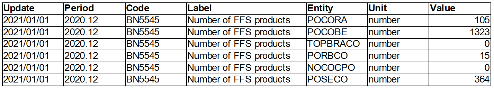
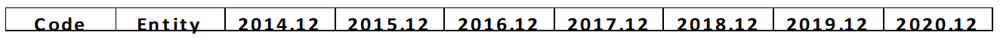

=============
Practise Test
=============

Introduction
============

Our client, a toy factory, wants to visualize his data into a dashboard. To help him achieve his goal, we will prepare two dataframes using sales information.

.. admonition:: Source data
    :class: hint

    The sales file is available with the ``pandas`` directory of the CDN, as
    ``sales.xlsx``. Please download this file and store it somewhere on our computer you
    can access it.

Tasks
=====

Part 1
------

This first part focuses on creating the first output data structure.

Question 1
~~~~~~~~~~

Using the input file, transform all the tables into one big table with the following structure:

- Update: Today’s Date
- Period (2020.12, 2019.12, 2018.12, etc.), the file has multiple tables, each table contains monthly information.
- Code (Column C in input file)
- Label (Column D in input file)
- Entity (POCORA, POCOBE, TOPBRACO, PROBCO …)
- Unit (Column E in input file)
- Values

For example, an extract of the output,  for Period 2020.12, Code BN5545, will be:

Part 2
------

Question 2
~~~~~~~~~~

We need to create a report to understand the sales over the years for each pair of  Code
and Entity. Using first output, we will generate a new table with these headers.

The table must have a row per code and entity and the value for each year present in the data (column Value).

Here the expected header structure :

Question 3
~~~~~~~~~~

Replace Entity codes with their corresponding country.

- POCORA : Argentina
- POCOBE : France
- TOPBRACO : Germany
- PORBCO : Mexico
- NOCOCPO : Japan
- POSECO : China

Part 3
------

The goal of this third part is to save output as files.

Question 4
~~~~~~~~~~

Save the two previous output data structures as two separate CSV files.

Question 5
~~~~~~~~~~

Save the two previous output data structures as two separate spreadsheets within
the **same** Excel file.

Part 4 (optional)
-----------------

This third part is optional and will lead you through creating a third output file
for comparing the performance of each entity.

Question 6
~~~~~~~~~~

Build a chart representing the percentage of total sales represented by each Code on yearly basis, using the result from the second part.
